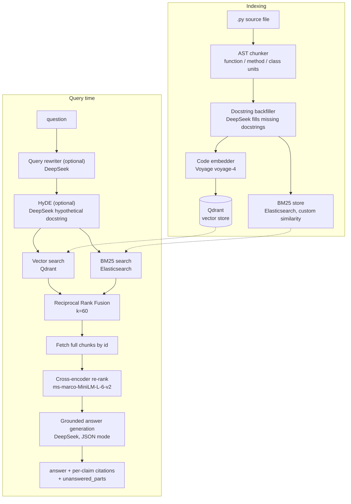

# Code RAG

[](https://github.com/sourav15102/RAG/actions/workflows/tests.yml)
[](pyproject.toml)
[](LICENSE)

A hybrid RAG pipeline purpose-built for **code search**, not generic document Q&A. It AST-chunks a Python codebase into function/method/class-sized units, indexes them with both vector and keyword search, fuses the two with Reciprocal Rank Fusion, re-ranks with a cross-encoder, and generates answers where every claim is cited back to a specific chunk and line range — with an explicit "I don't know" path when the retrieved code doesn't cover the question.

## Architecture



## Stack

| Stage | Choice | Why |
|---|---|---|
| Chunking | Python `ast` module | Chunks follow logical code boundaries (functions, methods, classes) instead of arbitrary token windows; oversized nodes fall back to bounded line splits |
| Docstring backfill | DeepSeek (`deepseek-chat`) | Cheap LLM call fills missing docstrings so undocumented code still has a natural-language summary for embedding and keyword search |
| Embeddings | Voyage AI `voyage-4` | Code-aware embedding model with separate document/query input types |
| Vector store | Qdrant | Persistent, named-vector ANN search |
| Keyword search | Elasticsearch, custom BM25 similarity (`k1=1.5`, `b=0.75`) | Catches exact identifier/symbol matches embeddings miss |
| Fusion | Reciprocal Rank Fusion (`k=60`) | Combines rank-only signals from two differently-scaled search systems without normalization |
| Query rewriting | DeepSeek (optional) | Expands abbreviations and adds technical keywords before search |
| HyDE | DeepSeek (optional) | Writes a hypothetical docstring and searches with that instead of the raw (short) query, closing the query/document embedding gap |
| Re-ranker | `cross-encoder/ms-marco-MiniLM-L-6-v2` | Pairwise scoring on the small fused candidate set for final precision |
| Answer generation | DeepSeek, JSON response mode | Returns an answer plus a list of claims, each tied to a `source_chunk`, `source_function`, and line range, plus an explicit `unanswered_parts` field |

Indexing also supports multi-repo scoping — `repo`/`tenant_id` are prefixed into chunk IDs and stored as filterable fields, so one Qdrant collection / Elasticsearch index can serve multiple codebases.

## Eval results

`eval_rag.py` runs the full pipeline against a 50-query golden set (`sample_docs/golden_set.json`) built from 5 sample services (`auth_service.py`, `data_pipeline.py`, `inventory_service.py`, `notification_service.py`, `search_indexer.py`), each query hand-labeled with the exact chunks that should be retrieved.

| Metric | Score |
|---|---|
| Precision@5 | 24.4% |
| Recall@5 | 91.0% |
| F1@5 | 37.5% |
| MRR | 0.85 |
| Hit rate | 98.0% |

Recall and hit rate are high because RRF over 50 candidates per arm rarely misses the right chunk entirely; precision@5 is capped by chunks that are topically related but not the *specific* one cited in the golden answer. Full per-query results (retrieved vs. golden chunks, precision/recall/F1/MRR per query) are written to `eval_results.json`. Re-run with `python eval_rag.py` — see `src/eval/evaluator.py` for the `top_k` / rerank settings used.

## Project structure

```
src/
  code_chunker/
    ast_chunker.py           # AST-based chunking: functions/methods/classes, line-fallback for oversized nodes
    docstring_backfiller.py  # DeepSeek fills missing docstrings
    code_chunker.py          # CodeChunker: chunk + backfill
  embedder/
    voyage_client.py         # Voyage AI HTTP client (batching, rate-limit backoff)
    code_embedder.py         # Formats chunks for embedding, wraps VoyageClient
  ingester/
    pipeline.py               # Pipeline / PipelineConfig — sequential Step chain
    step.py                   # Step ABC + PipelineContext
    ingester.py                # Ingester — runs multiple pipelines over one document concurrently
    steps/                     # ChunkStep, EmbedStep, StoreStep, BM25IndexStep, SearchStep
    storage/
      qdrant_store.py          # QdrantStore (vectors)
      bm25_store.py             # BM25Store (Elasticsearch wrapper)
      vector_store.py            # VectorStore ABC
  storage/
    es_store.py                 # Elasticsearch index schema + BM25 query
  search/
    rrf.py                      # Reciprocal Rank Fusion
    reranker.py                  # CrossEncoderReranker
    query_rewriter.py             # LLM query rewriting
    hyde.py                       # HyDE hypothetical-docstring generation
    fetcher.py                     # Resolve chunk ids → full CodeChunk payloads from Qdrant
    generator.py                    # Grounded answer generation with citations
    utils/llm.py                     # Shared DeepSeek chat-completion client
  eval/
    evaluator.py                     # RAGEvaluator — precision/recall/MRR/hit-rate on the golden set
ingest.py                              # CLI: index a directory of .py files
query.py                                # CLI: ask a question against the index
eval_rag.py                              # CLI: run the eval suite
sample_docs/                              # 5 sample Python services + the golden query set
tests/                                     # 112 tests, fully mocked — no live services required
Dockerfile                                  # app image: deps + src + CLIs
docker-compose.yml                           # qdrant + elasticsearch + app (idle, run via `exec`)
```

## Setup

**Prerequisites:** Docker, a [DeepSeek](https://platform.deepseek.com) API key, a [Voyage AI](https://www.voyageai.com) API key. (Python 3.13+ only if you run outside Docker.)

**1. Clone and set your API keys**
```bash
git clone https://github.com/sourav15102/RAG.git
cd RAG
cp .env.example .env
# edit .env: DEEPSEEK_API_KEY=..., VOYAGE_API_KEY=...
```

**2. Start everything — Qdrant, Elasticsearch, and the app itself**
```bash
docker compose up -d --build
```
The `app` container installs its own dependencies and stays idle (`tail -f /dev/null`); you run commands into it with `docker compose exec`. `qdrant` and `elasticsearch` are reachable from inside `app` by service name — no host/port flags needed.

**3. Index the sample codebase**
```bash
docker compose exec app python ingest.py --source sample_docs
```
This chunks each file, backfills missing docstrings via DeepSeek, embeds with Voyage, and writes to both Qdrant and Elasticsearch — expect a couple of minutes due to LLM calls and embedding rate limits.

**4. Ask a question**
```bash
docker compose exec app python query.py "How does the login flow check if an account is locked before verifying the password?" --verbose
```

<details>
<summary>Prefer running without Docker for the app itself?</summary>

```bash
uv sync                       # or: pip install -r requirements.txt
docker compose up -d qdrant elasticsearch
python ingest.py --source sample_docs
python query.py "your question"
```
`ingest.py`/`query.py` default to `localhost` for both services; inside `app`'s container they instead read `QDRANT_HOST` / `QDRANT_PORT` / `ES_HOST`, which `docker-compose.yml` sets to the service names.
</details>

## Indexing your own codebase

Python only — the chunker walks the `ast` module, which doesn't parse other languages. Any directory tree of `.py` files works; `.git`, `.venv`, `venv`, `node_modules`, `__pycache__`, `build`, and `dist` are skipped automatically.

**Locally:** point `--source` at any path on disk.
```bash
python ingest.py --source /path/to/your/project --collection your-project --repo your-project
python query.py "your question" --collection your-project
```

**In Docker:** the `app` container only sees what was baked into the image at build time, so drop the codebase under `repos/` (bind-mounted read-only into the container at `/repos`, gitignored) instead of pointing at an arbitrary host path.
```bash
cp -r /path/to/your/project repos/your-project
docker compose exec app python ingest.py --source /repos/your-project --collection your-project --repo your-project
docker compose exec app python query.py "your question" --collection your-project
```

`--collection` keeps a codebase's chunks in their own Qdrant collection / Elasticsearch index — leave it as `code_chunks` and you'll mix chunks from every project you've indexed into one store. `--repo` additionally prefixes chunk IDs so multiple repos can safely share one collection if you want cross-repo search later.

## CLI reference

Prefix any command below with `docker compose exec app` to run it inside the container, or drop the prefix to run locally (see above).

### `ingest.py`
```bash
python ingest.py [--source DIR] [--qdrant-host HOST] [--qdrant-port PORT] [--es-host URL] [--collection NAME] [--repo NAME]
```

| Flag | Default | Description |
|---|---|---|
| `--source` | `sample_docs` | Directory of `.py` files to index |
| `--collection` | `code_chunks` | Qdrant collection / Elasticsearch index name |
| `--repo` | *(none)* | Repo/namespace prefix, for indexing multiple codebases into one store |

### `query.py`
```bash
python query.py "your question" [flags]
```

| Flag | Default | Description |
|---|---|---|
| `--top-k` | `50` | Candidates fetched per search arm (vector + BM25 each) before fusion |
| `--top-n` | `3` | Chunks kept after cross-encoder re-ranking |
| `--rewrite` | off | Enable LLM query rewriting |
| `--hyde` | off | Enable HyDE hypothetical-docstring search |
| `--verbose` | off | Print retrieved chunk ids before the answer |

### Examples
```bash
# Full pipeline with citations
docker compose exec app python query.py "What does DataPipeline.run do on failure?" --verbose

# With query rewriting and HyDE enabled
docker compose exec app python query.py "why would inventory go negative" --rewrite --hyde

# Run the eval suite
docker compose exec app python eval_rag.py
```

---

## Learnings

### Grounded generation over free-form generation
The generator's system prompt forces a strict JSON contract: an `answer`, a list of `claims` each tied to a `source_chunk` / `source_function` / line range with a confidence level, and an explicit `unanswered_parts` field. This turns "does the model know the answer" into "can every sentence in the answer be traced to a retrieved chunk" — a much easier thing to verify, and it naturally surfaces when retrieval failed instead of letting the model paper over gaps with general knowledge.

### AST chunking beats fixed-size chunking for code
Splitting code by token count cuts functions in half and destroys the structure a reader (or embedding model) relies on. Walking the AST and emitting one chunk per function/method/class keeps each chunk semantically whole. Oversized nodes (a 400-line function) still need a bound, so those fall back to line-based sub-splits — rare in practice, but without it a single pathological function could blow out context.

### Why chunks get a docstring even when the source doesn't have one
BM25 and embeddings both do better with natural-language signal, not just code tokens. `DocstringBackfiller` calls a cheap LLM (DeepSeek) to generate a one-line summary for any chunk missing a docstring, so keyword search has real words to match against and the embedding isn't relying purely on identifier names and syntax.

### Reciprocal Rank Fusion (RRF)
The formula is `score(d) = Σ 1 / (k + rank(d))` where `k=60` is a standard damping constant. The key property: **you never need to normalize scores across systems**. Vector search returns cosine similarities (0–1), BM25 returns unbounded term-frequency scores — completely different scales. RRF only uses rank position, so scale differences don't matter. A chunk appearing in both lists gets boosted regardless of what its individual scores were.

### HyDE (Hypothetical Document Embeddings)
Short queries live in a different part of embedding space than long documents. HyDE bridges this gap: ask the LLM to write a hypothetical docstring that would answer the question, then embed that instead of the raw query. The hypothetical text is longer, uses domain vocabulary, and matches the style of indexed content — so it lands closer to the right chunks in vector space. BM25 still searches on the original query, since keyword matching doesn't have this semantic gap problem.

### Cross-encoder vs. bi-encoder
Bi-encoders (Voyage) encode query and document **separately**, then compare vectors — fast, but loses the interaction signal between the two. Cross-encoders take `(query, document)` as a single input and score the pair directly — much more accurate, but too slow to run over an entire corpus. That's why the cross-encoder only runs on the small candidate set that survives RRF, not the full index.

### RRF `top_k` vs. cross-encoder `top_n` are separate knobs
Widening `top_k` (candidates fetched per search arm before fusion) improves recall — more chances for the right chunk to be *somewhere* in the fused list. Tightening `top_n` (what survives the cross-encoder) improves precision — fewer, better-ranked chunks reach the generator. Tuned independently: `top_k=50` for high recall, `top_n=3` to keep the generator's context focused.

### Python 3.9 union syntax
`X | None` needs `from __future__ import annotations` (or Python 3.10+) to parse on older interpreters — otherwise it raises `TypeError` at import time, not at type-check time, which makes the failure confusing.

### `brew install docker` vs. Docker Desktop
`brew install docker` installs the CLI only, with no daemon — `docker run` fails with "cannot connect to the Docker daemon". You need Docker Desktop or Colima (`brew install colima && colima start`) to actually run containers.

## License

[MIT](LICENSE)
